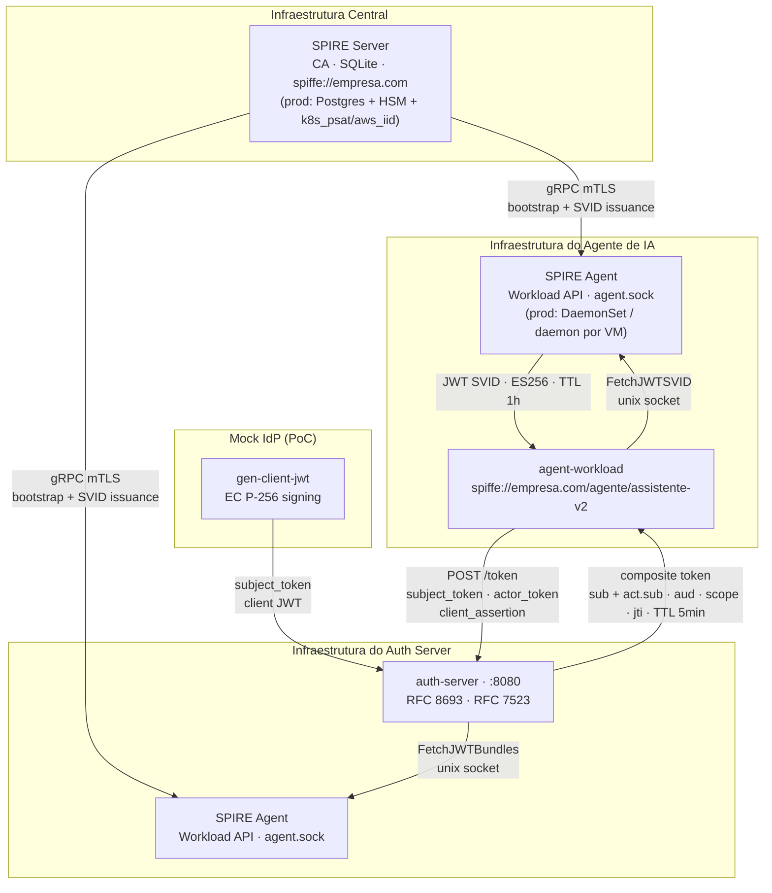

# AI Identity PoC

Prova de conceito de IAM para agentes de IA em ambiente corporativo, baseada no Internet-Draft IETF [`draft-klrc-aiagent-auth-00`](https://datatracker.ietf.org/doc/draft-klrc-aiagent-auth/) (março 2026).

Demonstra como um agente de IA pode acessar ferramentas expostas por um MCP Server com **identidade verificável** e **delegação preservada** — sem API keys estáticas, sem tokens de longa duração.

## Arquitetura (Tasks 1–3 implementadas)



> **PoC vs Produção:** na PoC, `agent-workload` e `auth-server` compartilham o mesmo SPIRE Agent via volume Docker.
> Em produção, cada nó/pod tem seu próprio Agent co-localizado, todos conectados ao SPIRE Server central.

## Cenário

O cliente autenticado envia seu JWT ao agente. O agente possui uma identidade SPIFFE emitida pelo SPIRE e executa um **OAuth 2.0 Token Exchange** (RFC 8693) no Authorization Server, que produz um token composto carregando tanto o contexto do usuário quanto a identidade do agente.

## Stack

| Componente | Tecnologia |
|---|---|
| Workload Identity | [SPIFFE/SPIRE](https://spiffe.io) |
| Token Exchange | OAuth 2.0 RFC 8693 |
| Client Auth | JWT Bearer Assertion RFC 7523 |
| Linguagem | Go + [go-spiffe/v2](https://github.com/spiffe/go-spiffe) |
| Infraestrutura local | Docker Compose |

## Pré-requisitos

- Docker e docker-compose
- Go 1.22+
- Make

## Como rodar

```sh
# 1. Subir SPIRE Server + Agent
make up

# 2. Registrar o workload do agente
make register

# 3. Validar emissão de SVID via CLI
make validate

# 4. Buscar SVID programaticamente via Go
make run-workload
```

## Roadmap da PoC

| # | Tarefa | Status |
|---|---|---|
| 1 | SPIRE Server + Agent via docker-compose, validar emissão de SVID | ✅ |
| 2 | `agent-workload` em Go busca SVID via Workload API | ✅ |
| 3 | Authorization Server com endpoint `/token` (RFC 8693) | ✅ |
| 4 | MCP Server com validação de token composto | 🔲 |
| 5 | Fluxo end-to-end com teste automatizado | 🔲 |
| 6 | mTLS entre agente e MCP Server (X.509-SVID) | 🔲 |
| 7 | Audit logging estruturado | 🔲 |
| 8 | Extensão para Kubernetes com `k8s_psat` | 🔲 |

## Referências

- [`draft-klrc-aiagent-auth-00`](https://datatracker.ietf.org/doc/draft-klrc-aiagent-auth/) — AI Agent Authentication (IETF, março 2026)
- [RFC 8693](https://www.rfc-editor.org/rfc/rfc8693) — OAuth 2.0 Token Exchange
- [RFC 7523](https://www.rfc-editor.org/rfc/rfc7523) — JWT Profile for OAuth 2.0 Client Authentication
- [RFC 9068](https://www.rfc-editor.org/rfc/rfc9068) — JWT Profile for OAuth 2.0 Access Tokens
- [SPIFFE/SPIRE Docs](https://spiffe.io/docs/latest/)
