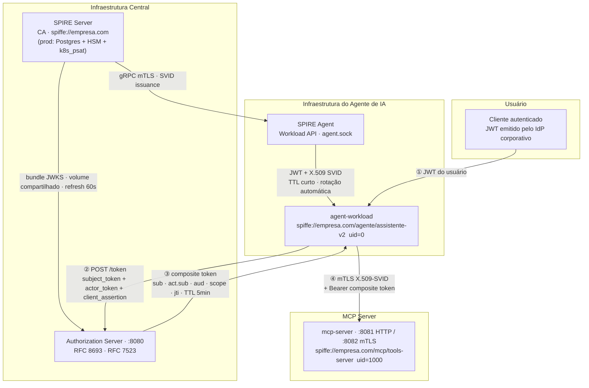

# AI Identity PoC

Prova de conceito de IAM para agentes de IA em ambiente corporativo, baseada no Internet-Draft IETF [`draft-klrc-aiagent-auth-00`](https://datatracker.ietf.org/doc/draft-klrc-aiagent-auth/) (março 2026).

Demonstra como estabelecer um canal seguro e auditável entre um **humano autenticado**, um **agente de IA com identidade verificável** e um **MCP Server** — sem API keys estáticas, sem tokens de longa duração, sem repassar credenciais do usuário.

---

## O problema

Quando um agente de IA acessa recursos em nome de um usuário, duas perguntas precisam de resposta verificável:

1. **Quem é o agente?** — Qualquer processo pode alegar ser um agente autorizado.
2. **Por conta de quem ele age?** — O contexto do usuário precisa ser preservado e auditável até o recurso final.

Sem resposta criptográfica para essas perguntas, um MCP Server não tem como distinguir uma requisição legítima de uma forjada.

---

## A solução



**①** O usuário apresenta seu JWT ao agente — o agente nunca repassa esse JWT para outros serviços.

**②** O agente faz um [OAuth 2.0 Token Exchange (RFC 8693)](https://www.rfc-editor.org/rfc/rfc8693), apresentando o JWT do usuário e seu próprio SVID. O Authorization Server valida ambos.

**③** O Authorization Server emite um **composite token**: um JWT que carrega o usuário em `sub` e a identidade do agente em `act.sub` (claim de delegação). Válido por 5 minutos, vinculado ao MCP Server específico.

**④** O agente abre uma conexão **mTLS** com o MCP Server (ambos os lados autenticam com X.509 SVIDs do SPIRE) e apresenta o composite token no header `Authorization`. O MCP Server valida **ambas as camadas** antes de executar qualquer ferramenta.

---

## Garantias de segurança

| Garantia | Mecanismo |
|---|---|
| Identidade do agente verificável | X.509/JWT SVID criptograficamente assinado pelo SPIRE CA |
| Usuário preservado até o recurso | Claim `sub` no composite token, imutável após o exchange |
| Agente identificável no audit log | Claim `act.sub` = SPIFFE ID do agente em todos os eventos |
| Transporte cifrado e autenticado | mTLS com X.509 SVIDs — sem certificados autoassinados ou CA manual |
| Credenciais de curta duração | JWT SVID TTL 1h, composite token TTL 5min |
| Audience restrita | Composite token vinculado ao MCP Server via `aud`; não reutilizável em outro serviço |
| Rastreabilidade entre serviços | `jti` correlaciona eventos de audit no auth-server e no mcp-server |
| Sem API keys | Nenhum componente usa segredos estáticos em tempo de execução |

---

## Antipadrões evitados

- O agente **nunca repassa** o JWT original do usuário ao MCP Server
- O MCP Server **nunca recebe** o SVID bruto do agente
- Nenhuma credencial de longa duração trafega entre serviços
- O MCP Server não precisa conhecer o IdP do usuário

---

## Stack

| Camada | Tecnologia |
|---|---|
| Workload Identity | [SPIFFE/SPIRE](https://spiffe.io) |
| Token Exchange | [RFC 8693](https://www.rfc-editor.org/rfc/rfc8693) OAuth 2.0 Token Exchange |
| Client Authentication | [RFC 7523](https://www.rfc-editor.org/rfc/rfc7523) JWT Bearer Assertion |
| Access Token Profile | [RFC 9068](https://www.rfc-editor.org/rfc/rfc9068) JWT Access Token |
| AI Agent Auth Draft | [draft-klrc-aiagent-auth-00](https://datatracker.ietf.org/doc/draft-klrc-aiagent-auth/) |
| Linguagem | Go 1.22 + [go-spiffe/v2](https://github.com/spiffe/go-spiffe) + [go-jose/v4](https://github.com/go-jose/go-jose) |
| Infraestrutura local | Docker Compose |

---

## Estrutura do projeto

```
ai_identity/
├── cmd/
│   ├── agent-workload/     # Agente de IA: busca SVID, faz token exchange, chama MCP via mTLS
│   └── mcp-server/         # MCP Server: valida composite token + listener mTLS (X.509-SVID)
├── internal/
│   ├── audit/              # Logging estruturado JSON (log/slog) — eventos de segurança
│   ├── mcptoken/           # Validator do composite token (JWKS cache, ES256, RFC 8693)
│   └── spiffe/             # Helpers go-spiffe: JWT SVID, X509Source, MTLSServerConfig/ClientConfig
├── auth-server/            # Módulo Go independente
│   ├── cmd/server/         # Authorization Server :8080
│   ├── cmd/gen-client-jwt/ # Gerador de JWT de cliente (mock IdP para PoC)
│   └── internal/
│       ├── audit/          # Logging estruturado do auth-server
│       ├── jwks/           # Chave de assinatura EC P-256 + BundleFile (SPIRE JWKS)
│       ├── policy/         # Política de delegação (CanDelegate)
│       └── tokenexchange/  # Handler POST /token (RFC 8693)
├── test/e2e/               # 10 testes Go de integração (build tag: e2e)
├── config/                 # Configurações SPIRE Server/Agent + chaves IdP
├── docker/                 # Dockerfiles multi-stage
└── scripts/                # start.sh, register-entries.sh, test-mcp.sh
```

---

## Pré-requisitos

- Docker Desktop
- `docker-compose` (standalone) ou Docker com Compose plugin
- Go 1.22+
- `make`

---

## Como rodar

```sh
# 1. Gerar par de chaves do mock IdP (apenas na primeira vez)
make gen-idp-keys

# 2. Subir toda a stack (SPIRE Server → Agent → Auth Server → MCP Server)
make up

# 3. Registrar os workloads no SPIRE
#    - spiffe://empresa.com/agente/assistente-v2  (uid 0)
#    - spiffe://empresa.com/mcp/tools-server      (uid 1000)
make register

# 4. Validar emissão de SVID JWT via CLI
make validate

# 5. Teste E2E via script shell (token exchange + 3 chamadas ao MCP Server)
make test-mcp

# 6. Testes automatizados Go (10 casos, requer ambiente up)
make test-e2e

# 7. Fluxo completo com mTLS (agente → token exchange → MCP Server via mTLS)
make run-agent
```

---

## Composite token

O token emitido pelo Authorization Server após o exchange:

```json
{
  "iss": "https://auth.empresa.com",
  "sub": "user-8f3a2c",
  "aud": "https://mcp-server.internal/api",
  "exp": 1745276700,
  "iat": 1745276400,
  "scope": "mcp:tools:read mcp:knowledge:search",
  "act": { "sub": "spiffe://empresa.com/agente/assistente-v2" },
  "client_id": "spiffe://empresa.com/agente/assistente-v2",
  "jti": "txn-9d4e1f82"
}
```

- `sub` — identidade do usuário (preservada do JWT original do IdP)
- `act.sub` — SPIFFE ID do agente (RFC 8693 §4.1 — delegation claim)
- `aud` — vinculado ao MCP Server específico (confused deputy defense)
- `jti` — ID único da transação; correlaciona eventos nos dois serviços

---

## Audit logs

Todos os eventos de segurança são emitidos como JSON no stdout de cada serviço, prontos para ingestão por SIEM.

**auth-server** — token exchange bem-sucedido:
```json
{
  "time": "2026-04-29T01:26:00Z", "level": "INFO",
  "service": "auth-server", "event": "token_exchange_success",
  "sub": "user-8f3a2c",
  "agent": "spiffe://empresa.com/agente/assistente-v2",
  "jti": "txn-cec74237d99c3bc4",
  "resource": "https://mcp-server.internal/api",
  "scope": "mcp:tools:read mcp:knowledge:search"
}
```

**mcp-server** — ferramenta invocada:
```json
{
  "time": "2026-04-29T01:26:00Z", "level": "INFO",
  "service": "mcp-server", "event": "mcp_tool_called",
  "sub": "user-8f3a2c",
  "agent": "spiffe://empresa.com/agente/assistente-v2",
  "jti": "txn-cec74237d99c3bc4",
  "tool": "knowledge_search", "status": "success"
}
```

O campo `jti` é idêntico nos dois serviços — uma query por `jti` no SIEM reconstrói o ciclo de vida completo de uma transação.

---

## Referências

- [`draft-klrc-aiagent-auth-00`](https://datatracker.ietf.org/doc/draft-klrc-aiagent-auth/) — AI Agent Authentication (IETF, março 2026)
- [RFC 8693](https://www.rfc-editor.org/rfc/rfc8693) — OAuth 2.0 Token Exchange
- [RFC 7523](https://www.rfc-editor.org/rfc/rfc7523) — JWT Profile for OAuth 2.0 Client Authentication
- [RFC 9068](https://www.rfc-editor.org/rfc/rfc9068) — JWT Profile for OAuth 2.0 Access Tokens
- [SPIFFE/SPIRE Docs](https://spiffe.io/docs/latest/)
